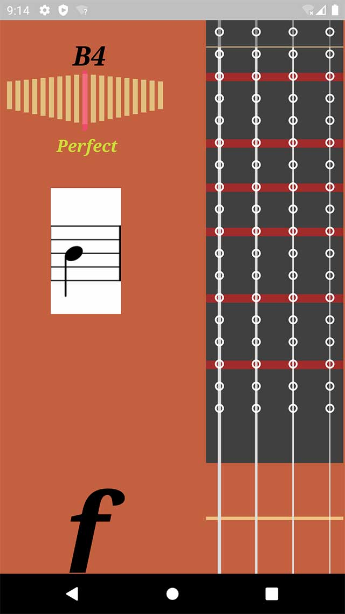

# violin_helper

Violin Pitch Helper
小提琴调音助手（Flutter）

## Web 输出选项

项目现在支持 **Flutter Web 输出**：

- Web 端会使用 `Web Preview` 页面（浏览器可用，避免移动端音频插件限制）。
- Android / iOS 端继续使用完整调音与发音能力。
- GitHub Actions 会自动执行 `flutter build web` 并发布到 GitHub Pages。
- 工作流固定使用 Flutter `2.10.5`（兼容当前项目的 Dart SDK 约束 `>=2.7.0 <3.0.0`）。

## GitHub 预览

仓库已提供工作流：`.github/workflows/static.yml`。

触发后会完成：

1. 安装 Flutter
2. 执行 `flutter pub get`
3. 执行 `flutter build web --release`
4. 将 `build/web` 发布到 GitHub Pages

> 首次启用请在仓库 **Settings → Pages** 中确认 Source 为 `GitHub Actions`。

## 本地运行

```bash
flutter pub get
flutter run
```

本地 Web：

```bash
flutter config --enable-web
flutter run -d chrome
```

## Reference

- [flutter_midi](https://pub.flutter-io.cn/packages/flutter_midi)
- [pitchdetector](https://pub.flutter-io.cn/packages/pitchdetector)
- [solve a bug in pitchdetector](https://stackoverflow.com/questions/58486139/avaudioengine-connect-crash-on-hardware-not-simulator)

```swift
do {
    try AVAudioSession.sharedInstance()
        .setCategory(AVAudioSession.Category.playAndRecord, options: .mixWithOthers);
} catch {
    print("error in setCategory");
}
```

## screenshot


